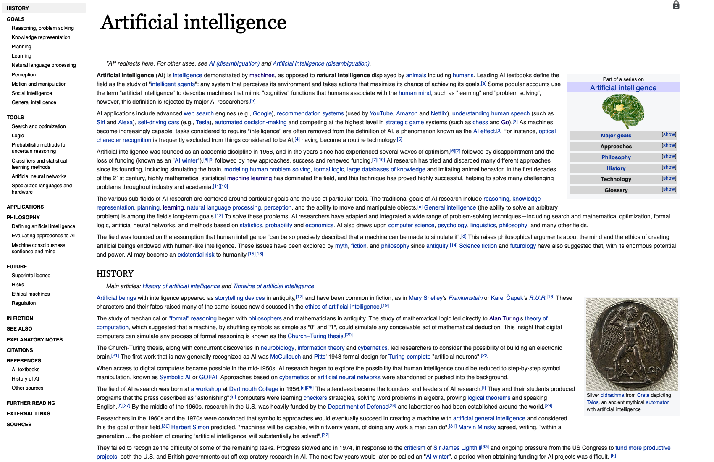
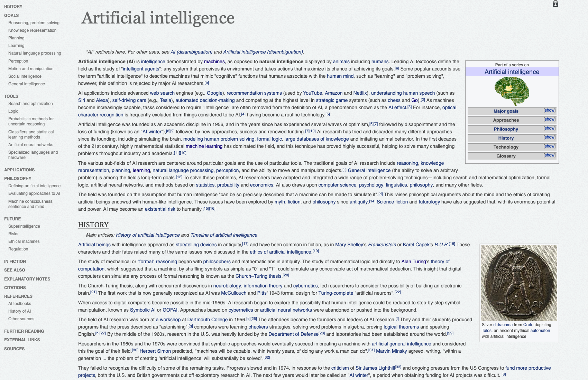

# Wikipedia Optimizor (Tampermonkey Userscript)

Userscript for wikipedia: Wikipedia optimizor, with various themes, smart toc sidebar, collapsible panel, explicit multilingual links, and handy optimizations

## Features

1. **Smart TOC Sidebar:** a content sidebar, with shadow following the scrolling and hovering, and color changing after visited
2. **Collapsible Panel:** a collapsible panel on left hand side, triggered by moving your cursor to the left
3. **Explicit Multilingual Link(s):** multilingual links to the corresponding wikipedia pages with explicit translated titles
4. **Semitransparent Header and Search Box:** a semitransparent header and search box on the top, triggered by moving your cursor to the head
5. **Hidden Warnings and Requests:** hide some warnings and donation request 

## Themes

### Transformer Theme (default)

An omnipotent all-in-one optimizor of wikipedia, containing all the features mentioned above.

Note that this theme is still under development (beta version). Further work is required to patch and clean the css code snippet and adjust the aesthetic design. However, this transformer theme is usable now and you just need to follow the procedures in the installation section.

### Academia Theme 

A black-and-white theme with clear citation links for academia and research, only contains the first feature.

### Warmpaper Theme

A stunning newspaper-like reading experience with minimalism design, only contains the first feature.

## To-Do List of Features

*  **Personal Account and Save Button:** The buttons for the personal page and save for later of the wikipedia account
* **External Search Links:** a set of customized external links for further search (e.g. google scholar, zhihu, douban, reddit, [wiki map](https://wikipedia.luk.ke))
* **Various Themes:** in the "theme" section of  javascript file, you can change the theme to one of them:
* Might also publish to gist and stylish

## Installation

1. Install [Tampermonkey](http://www.tampermonkey.net/) to your browser if you don't have one yet.
2. Click [this link](https://raw.githubusercontent.com/realliyifei/Userscript-Wikipedia-Optimizor/master/WikipediaOptimizor.user.js) to install *directly* (it will install automatically once being clicked and then you can close the tab).

## Limitations

This userscript has been tested *only* in English wikipedia pages, though it should be functionally general to all language versions.

## Credits & License

* The aesthetic design of *Warmpaper Theme* is inspired by Caspid's [Wikipedia Paper — sidebar edition](https://userstyles.org/styles/99183/wikipedia-paper-sidebar-edition) from stylish. 
* The code that implements collapsible panel and semitransparent header is mainly from Chen VinC's [Wikipedia Minima](https://userstyles.org/styles/166052/wikipedia-minima) from stylish.
